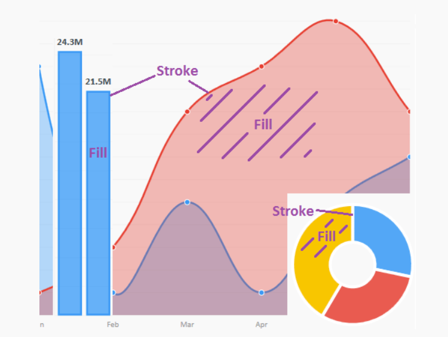

# Giới thiệu
LiveCharts được thiết kế để người dùng dễ dàng sử dụng, mọi thứ được cập nhật và hoạt ảnh tự động, thư viện sẽ chỉ cập nhật khi xét thấy cần thiết, không phải bất cứ khi nào dữ liệu của bạn thay đổi, khi bạn thêm / xóa chuỗi hoặc thêm / xóa giá trị biểu đồ. sẽ tự cập nhật, bạn không cần phải lo lắng về bất cứ điều gì ngoài việc kinh doanh của mình, hãy để LiveCharts xử lý biểu đồ
# Cài đặt
Bắt đầu một dự án mới và cài đặt từ NuGet. Từ Bảng điều khiển Trình quản lý Gói trong loại Visual Studio
```Csharp
 PM> Install-Package LiveCharts.Wpf
```
Hoặc đi tới Trình khám phá giải pháp, nhấp chuột phải vào tài liệu tham khảo, sau đó Quản lý gói NuGet ...


Duyệt qua LiveCharts.Wpf chọn gói và nhấp vào cài đặt:


Thêm không gian tên vào XAML của bạn

```csharp
1.  xmlns:lvc="clr-namespace:LiveCharts.Wpf;assembly=LiveCharts.Wpf"
```
Thêm không gian tên vào mã phía sau

```csharp
1.  using LiveCharts;
2.  using LiveCharts.Wpf;
```

# Cách sử dụng
Có nhiều kiểu sẵn sàng để vẽ biểu đồ đã được xác định, bạn có thể tìm hiểu thêm trong phần Loại và Cấu hình, trong ví dụ ngắn gọn này chúng ta đang vẽ đồ thị giá trị kép.
## Code Behind
```csharp
1.  SeriesCollection = new SeriesCollection
2.  {
3.   new LineSeries
4.   {
5.   Values = new ChartValues<double> { 3, 5, 7, 4 }
6.   },
7.   new ColumnSeries 
8.   {
9.   Values = new ChartValues<decimal> { 5, 6, 2, 7 }
10.   }
11.  };
```


## Code xalm
```csharp
1.  <lvc:CartesianChart Series="{Binding SeriesCollection}" />
```
### Ví dụ



------------------------------------------------
Trang trước: [Thư viện MaterialDesign](Thư%20viện%20MaterialDesign.md)
Trang sau: [Mô hình MVVM](Mô%20hình%20MVVM.md)